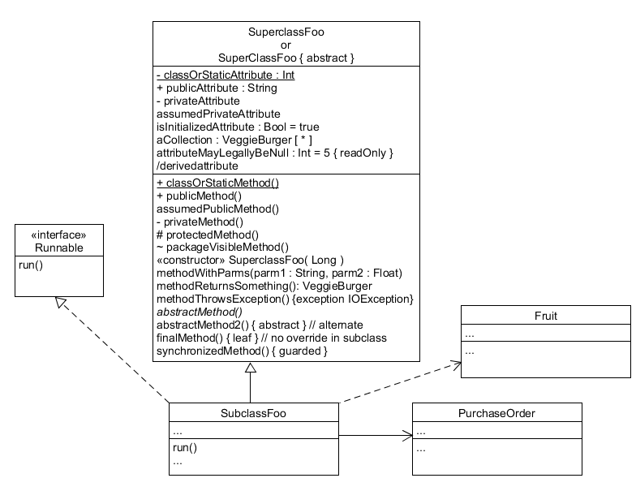

## 系统分析与设计 第2周作业
## 16340299 赵博然
### 用简短的语言给出对分析、设计的理解。
分析强调的是对问题和需求的调查研究, 而不是解决方案. 例如, 如果需要一个新的在线交易系统, 那么, 应该如何使用他?他应该具有哪些功能?

设计强调的是满足需求的概念上的解决方案(在软件方面和硬件方面), 而不是其实现. 例如, 对数据库方案和软件对象的描述. 设计思想通常排斥底层或"显而易见"的细节(对于预期消费者来说是显而易见的). 最终, 设计可以实现, 而实现(如代码)则表达了真实和完整的设计.

---
### 用一句话描述面向对象的分析与设计的优势。
使分析和设计更加清晰简洁, 便于理解和沟通.

---
### 简述 UML（统一建模语言）的作用。考试考哪些图？
统一建模语言(UML)是描述, 构造和文档化系统制品的可视化语言.

UML作为草图, UML作为蓝图, UML作为编程语言.

* 用例图
* 静态图
  * 类图
  * 对象图
  * 包图
* 行为图
  * 交互图
  * 状态图
  * 活动图
* 实现图
  * 构件图
  * 部署图

---
### 从软件本质的角度，解释软件范围（需求）控制的可行性
由于软件本身的复杂性、不可见性、不一致性、可变性，软件范围多数情况下对于客户和开发者都是模糊的，这形成软件产品与其他产品不同的开发过程。因此，范围管理是软件项目管理的重中之重！

软件工程是软件项目开发、运维与维护过程中最佳实践的总结，关注的都是常见场景的关键工作方法，掌握 20% 软件工程基础知识有助于提升 80% 项目的效率和质量。

细化 20% 有效需求，可满足 80% 客户需要，20% 测试可发现 80% BUG。正确发现并做好这 20% 正确的事情，需要熟练的业务能力、敏锐的观察能力、果断的执行能力，排除干扰，才意味着你的团队将以更少的付出、更短的周期获取跟多的客户，在残酷的竞争中获取领先位置。

---
### 看板使用练习

---
### UML绘图工具练习
UML和模式应用(原书第3版) / (美) 拉曼 (Larman, C.) 著; 李洋等译. -北京: 机械工业出版社, 2006.5 (2018.8重印), 181页

---